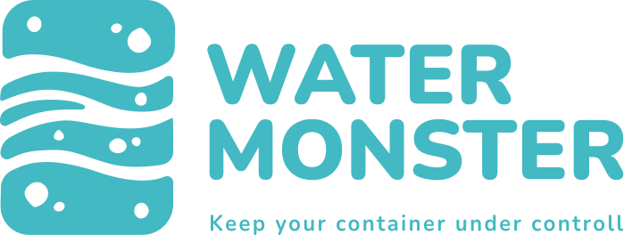
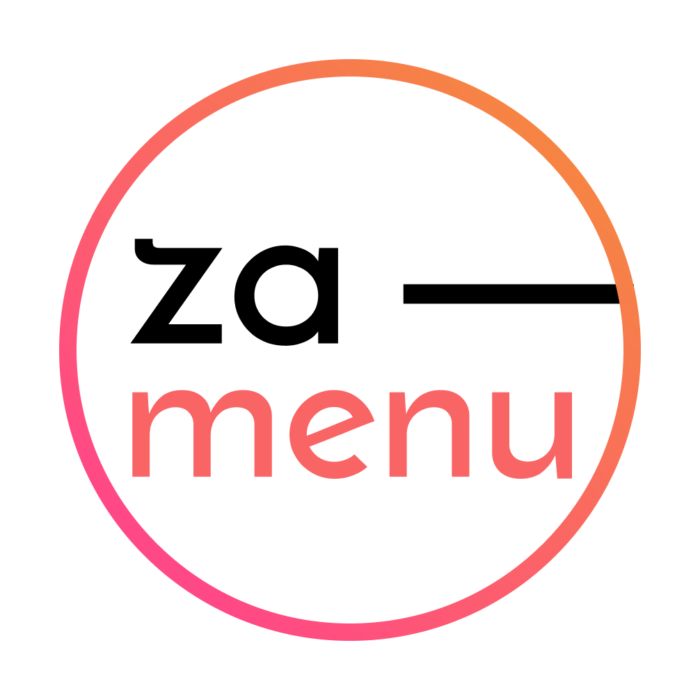

<h1 align="center">Hello world 👋, I'm Abdallah Moubarak</h1>

<h4 align="center">A full stack developer from Lebanon</h4>

---

## Index

#### [About me](#about)

#### [Contact me](#contact)

#### [Languages and Tools](#languages)

#### [Some projects](#some)

#### [Statistics](#statistic)

---

  

---

<h2 id='about'> ✨️ About me:</h2>

- 🌱 I’m currently learning **Firebase**

- 👨‍💻 Some of my projects are available at [abdallah.mobi](abdallah.mobi)

- 💬 Ask me about **react, nextjs, neo4j, graphql**

- 📫 How to reach me **abdallah.moubarak92@gmail.com**

---

<h2 id='contact'> 💬 Contact me </h2>

  <a href="https://www.linkedin.com/in/abdallah-mobarak">
     </a
  ><a href="https://wa.me/96170097533"
    ></a
  >

---

  

---

<h2 id='languages'> 🧰 Languages and Tools:</h2>

<table>
  <tr>
    <td>
      <h4>Graphic Design</h4>
    </td>
    <td>
      
      
      
    </td>
  </tr>
  <tr>
    <td>
      <h4>Programming languages</h4>
    </td>
    <td>
      
      
      
      
      
      
    </td>
  </tr>
  <tr>
    <td>
      <h4>Tools</h4>
    </td>
    <td>
      
      
      
    </td>
  </tr>

  <tr>
    <td>
      <h4>Frameworks & Libraries</h4>
    </td>
    <td>
      
      
      
      
      
      
      
      
      
      
      
      
      
      
      
      
    </td>
  </tr>

  <tr>
    <td>
      <h4>Database</h4>
    </td>
    <td>
      
      
      
    </td>
  </tr>
</table>

---

<h2 id='some'> 🔮 Some projects</h2>

<table>
  <tr>
    <th>Project name</th>
    <th>Project link</th>
    <th>Project logo</th>
  </tr>
  <!-- new project -->
  <tr>
    <td><h4>Water Monster</h4></td>
    <td>
      <a href="https://github.com/abdallahmoubarak/water-monster"
        >link</a
      >
    </td>
    <td></td>
  </tr>
  <tr>
    <td><h4>LinkedIn clone</h4></td>
    <td>
      <a href="https://github.com/abdallahmoubarak/simple-linkedin-clone"
        >link</a
      >
    </td>
    <td></td>
  </tr>
  <tr>
    <td><h4>E-learning system</h4></td>
    <td>
      <a href="https://github.com/abdallahmoubarak/e-learning-system-laravel-react-mongodb"
        >link</a
      >
    </td>
    <td></td>
  </tr>
  <tr>
    <td><h4>Friendoo - Dating app</h4></td>
    <td>
      <a href="https://github.com/abdallahmoubarak/friendoo-dating-app"
        >link</a
      >
    </td>
    <td></td>
  </tr>
  <tr>
    <td><h4>E-commerce - team project</h4></td>
    <td>
      <a href="https://github.com/abdallahmoubarak/e-commerce-team-project"
        >link</a
      >
    </td>
    <td></td>
  </tr>
  <tr>
    <td><h4>Twitter clone - team project</h4></td>
    <td>
      <a href="https://github.com/abdallahmoubarak/twitter-clone-team-project"
        >link</a
      >
    </td>
    <td></td>
  </tr>
  <tr>
    <td><h4>Smart Crystal</h4></td>
    <td>
      <a href="https://smart-crystal.vercel.app/"
        >link</a
      >
    </td>
    <td></td>
  </tr>
  <tr>
    <td><h4>EMR</h4></td>
    <td>
      <a href="https://emr.vercel.app/"
        >link</a
      >
    </td>
    <td></td>
  </tr>
  <tr>
    <td><h4>Za menu</h4></td>
    <td>
      <a href="https://za-menu.vercel.app/"
        >link</a
      >
    </td>
    <td></td>
  </tr>
  <tr>
    <td><h4>Moge Tee</h4></td>
    <td>
      <a href="https://mogetee.vercel.app/"
        >link</a
      >
    </td>
    <td></td>
  </tr>
  <tr>
    <td><h4>Za market</h4></td>
    <td>
      <a href="https://za-market.vercel.app/"
        >link</a
      >
    </td>
    <td></td>
  </tr>
  <tr>
    <td><h4>Want to see more !?</h4></td>
    <td>
      <a href="https://abdallah.mobi/My%20Work"
        >link</a
      >
    </td>
    <td></td>
  </tr>
</table>

---

<h2 id='statistic'> 📊 Statistics </h2>

  

  

  

